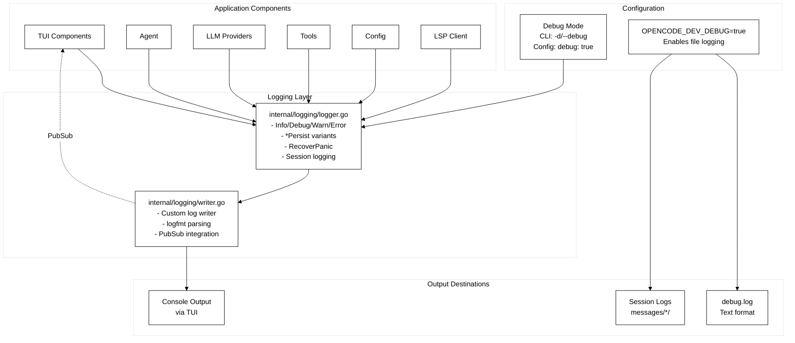
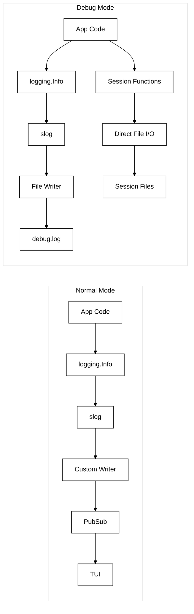
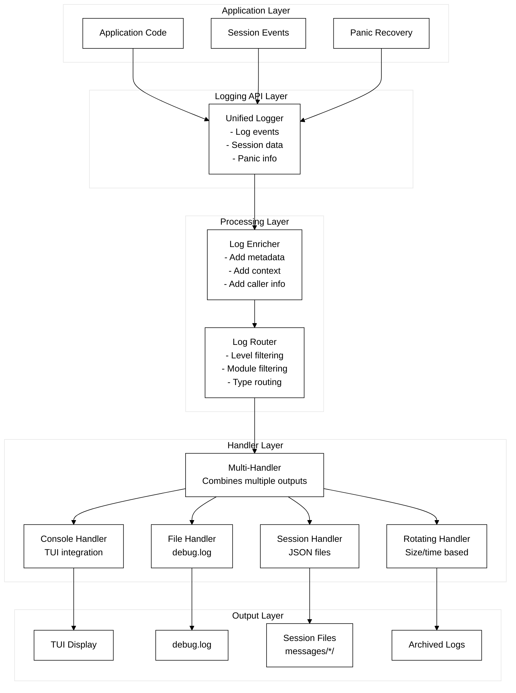
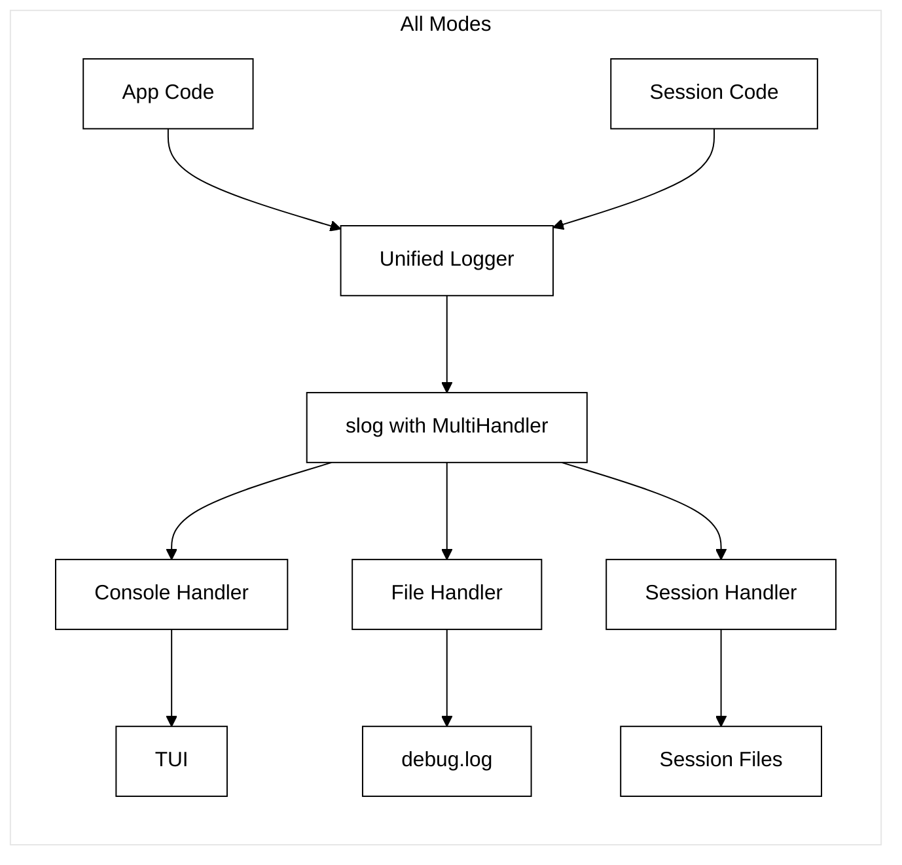

# OpenCode Logging Architecture: Complete Analysis

## Table of Contents
1. [Current State (BEFORE)](#current-state-before)
2. [Proposed State (AFTER)](#proposed-state-after)
3. [Implementation Guide](#implementation-guide)
4. [Benefits & Comparison](#benefits--comparison)

---

## Current State (BEFORE)

### Architecture Overview



### Current Problems

1. **Split Personality**: 
   - Regular logs use slog
   - Session logs bypass slog entirely with direct file I/O
   
2. **Either/Or Configuration**:
   ```go
   if os.Getenv("OPENCODE_DEV_DEBUG") == "true" {
       // Can ONLY write to file
       logger := slog.New(slog.NewTextHandler(fileWriter, opts))
   } else {
       // Can ONLY write to console
       logger := slog.New(slog.NewTextHandler(customWriter, opts))
   }
   ```

3. **Session Logging Bypass**:
   ```go
   // Current: Direct file writes, no slog
   func WriteRequestMessageJson(sessionId string, requestSeqId int, message any) string {
       msgJson, err := json.Marshal(message)
       // Direct file I/O - bypasses logging system
       f, err := os.OpenFile(filePath, os.O_APPEND|os.O_CREATE|os.O_WRONLY, 0644)
       _, err = f.WriteString(content)
   }
   ```

### Current Flow Diagram



### Key Limitations

| Aspect | Current State | Problem |
|--------|--------------|---------|
| Output Destinations | Either file OR console | Can't have both simultaneously |
| Session Logs | Direct file I/O | Bypasses logging system entirely |
| Configuration | Environment variable only | No config file, no runtime changes |
| Filtering | None | All logs go to single destination |
| Per-Module Config | Not supported | Same level for entire application |

---

## Proposed State (AFTER)

### Unified Architecture



### Unified Flow



### Key Improvements

1. **Everything Through slog**:
   ```go
   // BEFORE: Direct file write
   func WriteRequestMessageJson(sessionId string, requestSeqId int, message any) string {
       msgJson, err := json.Marshal(message)
       f.WriteString(content)  // Direct I/O
   }
   
   // AFTER: Through slog
   func WriteRequestMessageJson(sessionId string, requestSeqId int, message any) {
       slog.Info("api.request",
           "log_type", "session",
           "session_id", sessionId,
           "seq_id", requestSeqId,
           "data", message,
       )
   }
   ```

2. **Multiple Simultaneous Outputs**:
   ```go
   // BEFORE: Either/Or
   if debug {
       logger = fileLogger
   } else {
       logger = consoleLogger
   }
   
   // AFTER: Both/And
   handlers := []slog.Handler{
       consoleHandler,  // Always
       fileHandler,     // If debug
       sessionHandler,  // If debug
   }
   logger := slog.New(NewMultiHandler(handlers...))
   ```

---

## Implementation Guide

### Step 1: Multi-Handler Implementation

```go
// internal/logging/multihandler.go
type MultiHandler struct {
    handlers []slog.Handler
}

func NewMultiHandler(handlers ...slog.Handler) *MultiHandler {
    return &MultiHandler{handlers: handlers}
}

func (h *MultiHandler) Handle(ctx context.Context, r slog.Record) error {
    var errs []error
    for _, handler := range h.handlers {
        if handler.Enabled(ctx, r.Level) {
            if err := handler.Handle(ctx, r); err != nil {
                errs = append(errs, err)
            }
        }
    }
    return errors.Join(errs...)
}
```

### Step 2: Session File Handler

```go
// internal/logging/sessionhandler.go
type SessionFileHandler struct {
    baseDir string
    mu      sync.Mutex
}

func (h *SessionFileHandler) Handle(ctx context.Context, r slog.Record) error {
    // Extract session metadata
    var logType string
    r.Attrs(func(a slog.Attr) bool {
        if a.Key == "log_type" {
            logType = a.Value.String()
        }
        return true
    })
    
    // Only handle session logs
    if logType != "session" {
        return nil
    }
    
    // Write to appropriate session file
    // ... (implementation details)
}
```

### Step 3: Updated Configuration

```go
// internal/config/config.go
func setupLogging(cfg *Config) error {
    var handlers []slog.Handler
    
    // Console handler (always enabled)
    consoleHandler := NewFilterHandler(
        slog.NewTextHandler(logging.NewWriter(), &slog.HandlerOptions{
            Level: defaultLevel,
        }),
        excludeSessionLogs,  // Filter function
    )
    handlers = append(handlers, consoleHandler)
    
    // File handlers (if debug mode)
    if os.Getenv("OPENCODE_DEV_DEBUG") == "true" {
        // Debug log handler
        fileHandler := slog.NewTextHandler(debugFile, &slog.HandlerOptions{
            Level: slog.LevelDebug,
        })
        handlers = append(handlers, fileHandler)
        
        // Session file handler
        sessionHandler := NewSessionFileHandler(messagesDir)
        handlers = append(handlers, sessionHandler)
    }
    
    // Set multi-handler as default
    multiHandler := NewMultiHandler(handlers...)
    logger := slog.New(multiHandler)
    slog.SetDefault(logger)
    
    return nil
}
```

### Step 4: Configuration File Support

```json
{
  "logging": {
    "level": "info",
    "outputs": [
      {
        "type": "console",
        "level": "info",
        "filter": {
          "exclude_types": ["session"]
        }
      },
      {
        "type": "file",
        "level": "debug",
        "options": {
          "path": "debug.log",
          "rotate": true,
          "max_size": "100MB"
        }
      },
      {
        "type": "session",
        "filter": {
          "include_types": ["session"]
        },
        "options": {
          "base_dir": "messages"
        }
      }
    ]
  }
}
```

---

## Benefits & Comparison

### Side-by-Side Comparison

| Feature | BEFORE | AFTER |
|---------|---------|--------|
| **Output Destinations** | Either file OR console | Multiple simultaneous outputs |
| **Session Logging** | Direct file I/O, bypasses logging | Through slog with custom handler |
| **Configuration** | Environment variable only | Config file + runtime updates |
| **Filtering** | None | By level, module, type |
| **Architecture** | Split between slog and direct I/O | Unified through slog |
| **Extensibility** | Hard to add new outputs | Easy to add new handlers |
| **Testing** | Hard to mock file I/O | Easy to swap handlers |

### Performance Impact

- **Minimal overhead**: Handler checks are fast
- **Better than current**: Removes duplicate file operations
- **Scalable**: Can add buffering/batching per handler

### Migration Path

1. **Phase 1**: Implement multi-handler (non-breaking)
2. **Phase 2**: Add session handler (parallel to existing)
3. **Phase 3**: Migrate session logging to use slog
4. **Phase 4**: Add configuration file support
5. **Phase 5**: Deprecate old session functions

### Example Usage After Migration

```go
// All logging unified through single API
logging.Info("Server started", "port", 8080)              // Console + debug.log
logging.Debug("Request received", "method", "GET")        // Console (if debug) + debug.log
logging.WriteRequestMessageJson(sid, 1, request)          // Session file + debug.log
logging.ErrorPersist("Critical failure", "error", err)    // Console + debug.log + persist flag
```

## Summary

The proposed architecture unifies all logging through slog while maintaining specialized handling for different log types. This provides:

1. **Centralization**: Single API for all logging
2. **Flexibility**: Route any log to any destination
3. **Configurability**: File-based configuration with runtime updates
4. **Extensibility**: Easy to add new handlers/filters
5. **Maintainability**: Cleaner separation of concerns

The key insight is that session "logs" are really structured data dumps that belong in the logging system but need special handling - which custom handlers provide perfectly.